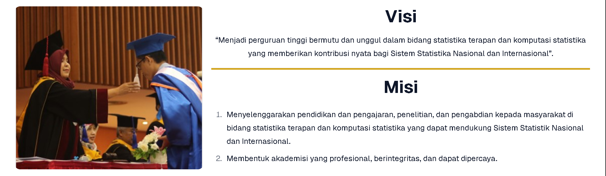
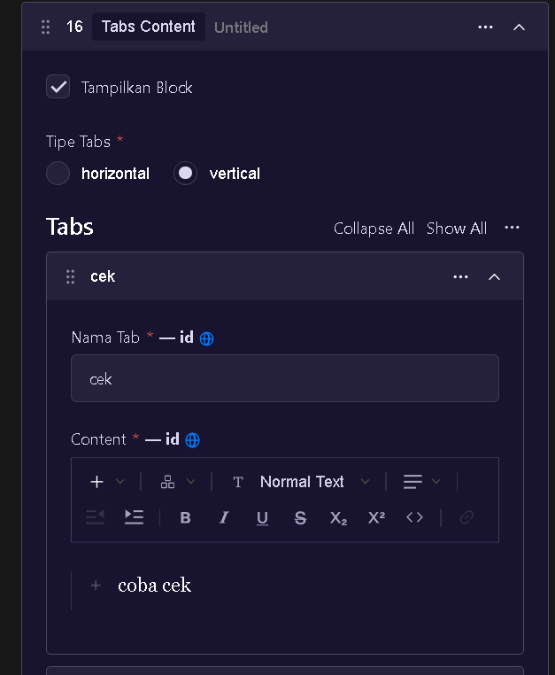

# Introduction

---

Blok adalah komponen-komponen yang digunakan untuk menyusun halaman di konten halaman CMS STIS. Pada saat ini jumlah blok/komponen yang ada yakni **28** blok. Berikut adalah beberapa jenis blok dan bentuknya:

---

# Table Of Content

- [Introduction](#introduction)
- [Table Of Content](#table-of-content)
- [Higlight Content](#higlight-content)
  - [1. Highlight Achievement](#1-highlight-achievement)
  - [2. Agenda](#2-agenda)
  - [3. Gallery Higlight](#3-gallery-higlight)
  - [4. Higlight Card](#4-higlight-card)
  - [5. Higlight Tab Content](#5-higlight-tab-content)
  - [6. Visi Misi](#6-visi-misi)
  - [7. Webinar Higlight](#7-webinar-higlight)
- [Raw Components](#raw-components)
  - [1. Accordion](#1-accordion)
  - [2. Call To Action](#2-call-to-action)
  - [3. Content](#3-content)
  - [4. Hero](#4-hero)
  - [5. Media](#5-media)
    - [Mendapatkan Embed Link Video Youtube](#mendapatkan-embed-link-video-youtube)
  - [6. Photo group](#6-photo-group)
  - [7. Slider Image](#7-slider-image)
  - [8. Tabs Content](#8-tabs-content)
  - [9. Timeline](#9-timeline)
- [Group Card](#group-card)
  - [1. Bento Group Card](#1-bento-group-card)
  - [2. Four Group Card](#2-four-group-card)
  - [3. N-Group Card](#3-n-group-card)
  - [4. Six Group Card](#4-six-group-card)
  - [5. Three Group Card](#5-three-group-card)
- [Content Layout](#content-layout)
  - [1. Content Layout Two Column](#1-content-layout-two-column)
  - [2. Content Layout Three Column](#2-content-layout-three-column)
- [Information \& FAQ](#information--faq)
  - [1. FAQ](#1-faq)
  - [2. Public Information](#2-public-information)
- [Other](#other)
  - [1. About STIS](#1-about-stis)
  - [2. Academic](#2-academic)
  - [3. Calendar](#3-calendar)

# Higlight Content

Group Higlight content berisi kumpulan konmponen yang mengambil data dari konten yang ada di CMS sehingga berfungsi sebagai higlight (sorotan konten)

## 1. Highlight Achievement

Gambar di atas adalah isian dari blok higlight achievement. Blok ini berfungsi menampilkan dan menyorot konten prestasi mahasiswa STIS

Berikut adalah penjelasan singkat dari beberapa isian yang ada di blok ini

| Isi Pertanyaan        | Deskripsi                                                                                                                                                                                                                                                                                                                                                                                                                                                                                                                                                                                                                                                                                                                                                                                                                                                                                    |
| --------------------- | -------------------------------------------------------------------------------------------------------------------------------------------------------------------------------------------------------------------------------------------------------------------------------------------------------------------------------------------------------------------------------------------------------------------------------------------------------------------------------------------------------------------------------------------------------------------------------------------------------------------------------------------------------------------------------------------------------------------------------------------------------------------------------------------------------------------------------------------------------------------------------------------- |
| Tampilkan block       | Apabila dicentang maka komponen ini akan tampil di halaman                                                                                                                                                                                                                                                                                                                                                                                                                                                                                                                                                                                                                                                                                                                                                                                                                                   |
| Warna Background      | Warna dari latar belakang komponen. Saat ini ada 5 jenis warna yang dapat dipakai, yakni Primary Secondary Accent DefaultNone |
| Tipe pengambilan data | Ada dua opsi dalam pengambilan data untuk higlightAchievement. `terbaru` digunakan jika ingin menampilkan otomatis data prestasi terbaru, `manual` jika ingin memilih sendiri prestasi yang ingin ditampilkan di komponen higlight achievement.                                                                                                                                                                                                                                                                                                                                                                                                                                                                                                                                                                                                                                              |

Berikut adalah contoh tampilan dari komponen higlight achievement

## 2. Agenda

Gambar di atas adalah isian dari blok agenda. Blok ini berfungsi untuk menampilkan 4 agenda terbaru dari masing-masing jenis agenda (telah lewat/akan datang)

Berikut adalah penjelasan singkat dari beberapa isian yang ada di blok ini

| Isi Pertanyaan        | Deskripsi                                                                                                                                                                                                                                                                                                                                                                                                                                                                                                                                                                                                                                                                                                                                                                                                                                                                                    |
| --------------------- | -------------------------------------------------------------------------------------------------------------------------------------------------------------------------------------------------------------------------------------------------------------------------------------------------------------------------------------------------------------------------------------------------------------------------------------------------------------------------------------------------------------------------------------------------------------------------------------------------------------------------------------------------------------------------------------------------------------------------------------------------------------------------------------------------------------------------------------------------------------------------------------------- |
| Tampilkan block       | Apabila dicentang maka komponen ini akan tampil di halaman                                                                                                                                                                                                                                                                                                                                                                                                                                                                                                                                                                                                                                                                                                                                                                                                                                   |
| Judul                 | Teks yang akan ditampilkan di atas komponen yang berfungsi sebagai judul komponen                                                                                                                                                                                                                                                                                                                                                                                                                                                                                                                                                                                                                                                                                                                                                                                                            |
| Posisi judul          | Posisi dari judul, apakah di `tengah` `kanan` atau `kiri`                                                                                                                                                                                                                                                                                                                                                                                                                                                                                                                                                                                                                                                                                                                                                                                                                                    |
| Warna Background      | Warna dari latar belakang komponen. Saat ini ada 5 jenis warna yang dapat dipakai, yakni Primary Secondary Accent DefaultNone |
| Tipe pengambilan data | Ada dua opsi dalam pengambilan data untuk agenda. `agenda yang akan datang` digunakan jika hanya ingin menampilkan agenda yang akan datang, `agenda yang telah lewat` jika hanya ingin menampilkan agenda yang telah berlalu, `semua agenda` menampilkan agenda baik yang akan datang maupun yang telah berlalu.                                                                                                                                                                                                                                                                                                                                                                                                                                                                                                                                                                             |

Berikut adalah contoh tampilan dari komponen agenda

## 3. Gallery Higlight

Gambar di atas adalah isian dari blok gallery higlight. Blok ini berfungsi menampilkan dan memberikan sorotan pada maksimal 6 konten galeri

Berikut adalah penjelasan singkat dari beberapa isian yang ada di blok ini

| Isi Pertanyaan        | Deskripsi                                                                                                                                                                                                                                                                                                                                                                                                                                                                                                                                                                                                                                                                                                                                                                                                                                                                                    |
| --------------------- | -------------------------------------------------------------------------------------------------------------------------------------------------------------------------------------------------------------------------------------------------------------------------------------------------------------------------------------------------------------------------------------------------------------------------------------------------------------------------------------------------------------------------------------------------------------------------------------------------------------------------------------------------------------------------------------------------------------------------------------------------------------------------------------------------------------------------------------------------------------------------------------------- |
| Tampilkan block       | Apabila dicentang maka komponen ini akan tampil di halaman                                                                                                                                                                                                                                                                                                                                                                                                                                                                                                                                                                                                                                                                                                                                                                                                                                   |
| Tipe pengambilan data | Ada dua opsi dalam pengambilan data untuk higlightAchievement. `terbaru` digunakan jika ingin menampilkan otomatis data prestasi terbaru, `manual` jika ingin memilih sendiri prestasi yang ingin ditampilkan di komponen higlight achievement.                                                                                                                                                                                                                                                                                                                                                                                                                                                                                                                                                                                                                                              |
| Warna Background      | Warna dari latar belakang komponen. Saat ini ada 5 jenis warna yang dapat dipakai, yakni Primary Secondary Accent DefaultNone |
| Tipe pengambilan data | Ada dua opsi dalam pengambilan data untuk agenda. `agenda yang akan datang` digunakan jika hanya ingin menampilkan agenda yang akan datang, `agenda yang telah lewat` jika hanya ingin menampilkan agenda yang telah berlalu, `semua agenda` menampilkan agenda baik yang akan datang maupun yang telah berlalu.                                                                                                                                                                                                                                                                                                                                                                                                                                                                                                                                                                             |

Berikut adalah contoh tampilkan dari gallery higlight

## 4. Higlight Card

Gambar di atas adalah isian dari blok higlight card. Gambar pertama jika memilih higlight dari data terbaru pada konten yang dipilih. Sedangkan gambar kedua dengan memilih manual data konten mana yang mau dihiglight. Blok ini berfungsi untuk menampilkan dan menyoroti maksimal 3 data dalam bentuk card dari tiap jenis konten yang ada di situs web.

Berikut adalah penjelasan singkat dari beberapa isian yang ada di blok ini

| Isi Pertanyaan                                   | Deskripsi                                                                                                                                                                                                                                                                                                                                                                                                                                                                                                                                                                                                                                                                                                                                                                                                                                                                                    |
| ------------------------------------------------ | -------------------------------------------------------------------------------------------------------------------------------------------------------------------------------------------------------------------------------------------------------------------------------------------------------------------------------------------------------------------------------------------------------------------------------------------------------------------------------------------------------------------------------------------------------------------------------------------------------------------------------------------------------------------------------------------------------------------------------------------------------------------------------------------------------------------------------------------------------------------------------------------- |
| Tampilkan block                                  | Apabila dicentang maka komponen ini akan tampil di halaman                                                                                                                                                                                                                                                                                                                                                                                                                                                                                                                                                                                                                                                                                                                                                                                                                                   |
| Judul                                            | Teks yang akan ditampilkan di atas komponen yang berfungsi sebagai judul komponen                                                                                                                                                                                                                                                                                                                                                                                                                                                                                                                                                                                                                                                                                                                                                                                                            |
| Posisi judul                                     | Posisi dari judul, apakah di `tengah` `kanan` atau `kiri`                                                                                                                                                                                                                                                                                                                                                                                                                                                                                                                                                                                                                                                                                                                                                                                                                                    |
| Warna Background                                 | Warna dari latar belakang komponen. Saat ini ada 5 jenis warna yang dapat dipakai, yakni Primary Secondary Accent DefaultNone |
| Tipe pengambilan data                            | Ada dua opsi dalam pengambilan data untuk agenda. `agenda yang akan datang` digunakan jika hanya ingin menampilkan agenda yang akan datang, `agenda yang telah lewat` jika hanya ingin menampilkan agenda yang telah berlalu, `semua agenda` menampilkan agenda baik yang akan datang maupun yang telah berlalu.                                                                                                                                                                                                                                                                                                                                                                                                                                                                                                                                                                             |
| Sumber data                                      | Ada dua opsi dalam pengambilan data untuk higlightAchievement. `terbaru` digunakan jika ingin menampilkan otomatis data prestasi terbaru, `manual` jika ingin memilih sendiri prestasi yang ingin ditampilkan di komponen higlight achievement.                                                                                                                                                                                                                                                                                                                                                                                                                                                                                                                                                                                                                                              |
| Jenis konten yang ditampilkan / Pilih Collection | Memilih jenis konten yang ingin ditampilkan apakah `galeri`, `artikel`, `berita`, `prestasi`, `ukm ukk`, atau `agenda`                                                                                                                                                                                                                                                                                                                                                                                                                                                                                                                                                                                                                                                                                                                                                                       |
| batas jumlah data yang ditampilkan               | Membatasi jumlah data yang ditampilkan pada saat memilih sumber data `terbaru`. Maksimal 3                                                                                                                                                                                                                                                                                                                                                                                                                                                                                                                                                                                                                                                                                                                                                                                                   |
| Pilih `konten` yang ingin ditampilkan            | Memilih secara manual data `konten` yang ingin ditampilkan di komponen higlight card                                                                                                                                                                                                                                                                                                                                                                                                                                                                                                                                                                                                                                                                                                                                                                                                         |

Berikut adalah contoh tampilan dari higlight card

## 5. Higlight Tab Content

Gambar di atas adalah isian dari block higlight tab content. Blok ini berfungsi menampilkan dan memberikan sorotan kepada 3 jenis konten yang ada di situs web dengan mengambil masing-masing satu data untuk tiap konten yang disajikan dalam bentuk komponen tab.

Berikut adalah penjelasan dari isian block Higlight tab content
| Isi Pertanyaan | Deskripsi |
| --------------------- | ------------------------ |
| Tampilkan block | Apabila dicentang maka komponen ini akan tampil di halaman |
|Nama tab| tulisan penanda tab|
| Tipe pengambilan Higlight | Ada dua opsi dalam pengambilan data untuk higlight. `terbaru` digunakan jika ingin menampilkan otomatis data konten terbaru, `manual` jika ingin memilih sendiri higlight yang ingin ditampilkan di komponen higlight tab content. |
|Pilih collection| Memilih jenis konten yang ingin ditampilkan apakah `galeri`, `artikel`, `berita`, `prestasi`, `ukm ukk`, atau `agenda` |

Berikut adalah contoh tampilan dari komponen ini

## 6. Visi Misi

Gambar di atas adalah isian dari komponen visi misi. Blok ini berfungsi menampilkan visi misi.

Berikut adalah penjelasan dari isian block Higlight tab content

| Isi Pertanyaan   | Deskripsi                                                                                                                                                                                                                                                                                                                                                                                                                                                                                                                                                                                                                                                                                                                                                                                                                                                                                    |
| ---------------- | -------------------------------------------------------------------------------------------------------------------------------------------------------------------------------------------------------------------------------------------------------------------------------------------------------------------------------------------------------------------------------------------------------------------------------------------------------------------------------------------------------------------------------------------------------------------------------------------------------------------------------------------------------------------------------------------------------------------------------------------------------------------------------------------------------------------------------------------------------------------------------------------- |
| Tampilkan block  | Apabila dicentang maka komponen ini akan tampil di halaman                                                                                                                                                                                                                                                                                                                                                                                                                                                                                                                                                                                                                                                                                                                                                                                                                                   |
| Pilih Gambar     | upload atau memilih gambar untuk ditampilkan di komponen ini                                                                                                                                                                                                                                                                                                                                                                                                                                                                                                                                                                                                                                                                                                                                                                                                                                 |
| Posisi Gambar    | posisi dari gambar apakah di kiri atau kanan konten visi misi ( _berlaku untuk dekstop di mobile akan menyesuaikan sendiri_ )                                                                                                                                                                                                                                                                                                                                                                                                                                                                                                                                                                                                                                                                                                                                                                |
| warna garis      | warna pada garis pembatas antara visi dan misi. Jenis warnanya seperti warna background                                                                                                                                                                                                                                                                                                                                                                                                                                                                                                                                                                                                                                                                                                                                                                                                      |
| warna background | Warna dari latar belakang komponen. Saat ini ada 5 jenis warna yang dapat dipakai, yakni Primary Secondary Accent DefaultNone |

Berikut adalah tampilan dari komponen ini

## 7. Webinar Higlight

Gambar di atas adalah isian dari komponen Webinar Higlight. Komponen ini berfungsi untuk menampilkan sorotan pada salah satu data konten agenda bertipe webinar.

Berikut adalah penjelasan dari isian block webinar higlight

| Isi Pertanyaan        | Deskripsi                                                                                                                                                                                                                                                                                                                                                                                                                                                                                                                                                                                                                                                                                                                                                                                                                                                                                    |
| --------------------- | -------------------------------------------------------------------------------------------------------------------------------------------------------------------------------------------------------------------------------------------------------------------------------------------------------------------------------------------------------------------------------------------------------------------------------------------------------------------------------------------------------------------------------------------------------------------------------------------------------------------------------------------------------------------------------------------------------------------------------------------------------------------------------------------------------------------------------------------------------------------------------------------- |
| Tampilkan block       | Apabila dicentang maka komponen ini akan tampil di halaman                                                                                                                                                                                                                                                                                                                                                                                                                                                                                                                                                                                                                                                                                                                                                                                                                                   |
| Tipe pengambilan data | Ada dua opsi dalam pengambilan data untuk webinar higlight. `terbaru` digunakan jika ingin menampilkan otomatis data webinar terbaru, `manual` jika ingin memilih sendiri webinar yang ingin ditampilkan di komponen ini.                                                                                                                                                                                                                                                                                                                                                                                                                                                                                                                                                                                                                                                                    |
| Warna background      | Warna dari latar belakang komponen. Saat ini ada 5 jenis warna yang dapat dipakai, yakni Primary Secondary Accent DefaultNone |
| Warna button          | warna dari tombol untuk baca selengkapnya dan agenda lainnya. Jenis warnanya sama dengan warna background                                                                                                                                                                                                                                                                                                                                                                                                                                                                                                                                                                                                                                                                                                                                                                                    |

Berikut adalah tampilan dari komponen ini

# Raw Components

Group raw components adalah jenis komponen di website/aplikasi yang tidak mengambil data dari konten lainnya. Sebaliknya, kontennya ditulis langsung oleh pengelola halaman

## 1. Accordion

Gambar di atas adalah isian dari komponen accordion. Gambar ini berfungsi menampilkan komponen accordion yakni komponen di halaman web atau aplikasi yang bisa dibuka dan ditutup untuk menampilkan atau menyembunyikan isi. Mirip seperti daftar pertanyaan atau menu lipat.

Berikut adalah penjelasan dari tiap isian

| Isi Pertanyaan       | Deskripsi                                                                                                                                                                                                                                                                                                                                                                                                                                                                                                                                                                                                                                                                                                                                                                                                                                                                                          |
| -------------------- | -------------------------------------------------------------------------------------------------------------------------------------------------------------------------------------------------------------------------------------------------------------------------------------------------------------------------------------------------------------------------------------------------------------------------------------------------------------------------------------------------------------------------------------------------------------------------------------------------------------------------------------------------------------------------------------------------------------------------------------------------------------------------------------------------------------------------------------------------------------------------------------------------- |
| Tampilkan block      | Apabila dicentang maka komponen ini akan tampil di halaman                                                                                                                                                                                                                                                                                                                                                                                                                                                                                                                                                                                                                                                                                                                                                                                                                                         |
| Judul                | Teks yang akan ditampilkan di atas komponen yang berfungsi sebagai judul komponen                                                                                                                                                                                                                                                                                                                                                                                                                                                                                                                                                                                                                                                                                                                                                                                                                  |
| Posisi judul         | Posisi dari judul, apakah di `tengah` `kanan` atau `kiri`                                                                                                                                                                                                                                                                                                                                                                                                                                                                                                                                                                                                                                                                                                                                                                                                                                          |
| Tipe warna accordion | Warna dari pembungkus komponen accordion. Saat ini ada 5 jenis warna yang dapat dipakai, yakni Primary Secondary Accent DefaultNone |
| Teks awal accordion  | Teks pendek yang muncul sebelum diklik. Gunanya sebagai judul atau ringkasan dari isi di dalamnya.                                                                                                                                                                                                                                                                                                                                                                                                                                                                                                                                                                                                                                                                                                                                                                                                 |
| Konten               | Isi lengkap yang akan muncul setelah diklik.Gunanya untuk menjelaskan lebih detail isi dari _Teks awal accordion_.                                                                                                                                                                                                                                                                                                                                                                                                                                                                                                                                                                                                                                                                                                                                                                                 |

Berikut tampilan dari komponen ini

## 2. Call To Action

Gambar di atas adalah isian untuk komponen call to action

Berikut adalah penjelasan dari tiap isian

| Isi Pertanyaan     | Deskripsi                                                                                                                                                                                                                                                                                                                                                                                                                                                                                                                                                                                                                                                                                                                                                                                                                                                                         |
| ------------------ | --------------------------------------------------------------------------------------------------------------------------------------------------------------------------------------------------------------------------------------------------------------------------------------------------------------------------------------------------------------------------------------------------------------------------------------------------------------------------------------------------------------------------------------------------------------------------------------------------------------------------------------------------------------------------------------------------------------------------------------------------------------------------------------------------------------------------------------------------------------------------------- |
| Tampilkan block    | Apabila dicentang maka komponen ini akan tampil di halaman                                                                                                                                                                                                                                                                                                                                                                                                                                                                                                                                                                                                                                                                                                                                                                                                                        |
| Warna background   | Warna dari komponen CTA. Saat ini ada 5 jenis warna yang dapat dipakai, yakni Primary Secondary Accent DefaultNone |
| Konten             | tulisan yang berada pada CTA                                                                                                                                                                                                                                                                                                                                                                                                                                                                                                                                                                                                                                                                                                                                                                                                                                                      |
| Tipe redirect link | jenis link apakah dari `internal link` yang mengarah ke halaman yang sudah terpublish atau `custom` yang mengambil dari link luar                                                                                                                                                                                                                                                                                                                                                                                                                                                                                                                                                                                                                                                                                                                                                 |
| Arahkan ke halaman | Pilih halaman mana yang ingin dituju jika klik tombol CTA                                                                                                                                                                                                                                                                                                                                                                                                                                                                                                                                                                                                                                                                                                                                                                                                                         |
| URL link           | link dari situs lain yang ingin dituju                                                                                                                                                                                                                                                                                                                                                                                                                                                                                                                                                                                                                                                                                                                                                                                                                                            |
| Label              | label dari tombol CTA                                                                                                                                                                                                                                                                                                                                                                                                                                                                                                                                                                                                                                                                                                                                                                                                                                                             |
| Appearance         | Tampilan dari button link apakah versi `default` atau `outline`                                                                                                                                                                                                                                                                                                                                                                                                                                                                                                                                                                                                                                                                                                                                                                                                                   |

Berikut adalah tampilan dari komponen CTA

## 3. Content

Gambar di atas adalah isian dari block content. Block ini umumnya digunakan untuk menulis paragraf yang dapat disertai tombol link

| Isi Pertanyaan     | Deskripsi                                                                                                                         |
| ------------------ | --------------------------------------------------------------------------------------------------------------------------------- |
| Tampilkan block    | Apabila dicentang maka komponen ini akan tampil di halaman                                                                        |
| Size               | Layout column dari richtext konten apakah `full` ,`one third` (1/3 halaman), `half` (setengah halaman) `two third` (2/3 halaman)  |
| Richtext           | konten yang ditampilkan                                                                                                           |
| Enable link        | Untuk menambahkan tombol link                                                                                                     |
| Tipe redirect link | jenis link apakah dari `internal link` yang mengarah ke halaman yang sudah terpublish atau `custom` yang mengambil dari link luar |
| Arahkan ke halaman | Pilih halaman mana yang ingin dituju jika klik tombol                                                                             |
| URL link           | link dari situs lain yang ingin dituju                                                                                            |
| Label              | label dari tombol CTA                                                                                                             |
| Appearance         | Tampilan dari button link apakah versi `default` atau `outline`                                                                   |

Berikut adalah tampilan dari komponen ini

## 4. Hero

Gambar di atas adalah isian untuk komponen hero. Hero adalah bagian di halaman depan (biasanya paling atas) yang menampilkan gambar besar yang bisa berganti-ganti secara otomatis atau manual, biasanya disertai teks dan tombol ajakan (seperti Pelajari Lebih Lanjut atau Daftar Sekarang).

Berikut adalah penjelasan dari isian komponen tersebut

| Isi Pertanyaan                      | Deskripsi                                                                                                                                                                                                                                                                                                                                                                                                                                                                                                                                                                                                                                                                                                                                                                                                                                                                                    |
| ----------------------------------- | -------------------------------------------------------------------------------------------------------------------------------------------------------------------------------------------------------------------------------------------------------------------------------------------------------------------------------------------------------------------------------------------------------------------------------------------------------------------------------------------------------------------------------------------------------------------------------------------------------------------------------------------------------------------------------------------------------------------------------------------------------------------------------------------------------------------------------------------------------------------------------------------- |
| Tampilkan block                     | Apabila dicentang maka komponen ini akan tampil di halaman                                                                                                                                                                                                                                                                                                                                                                                                                                                                                                                                                                                                                                                                                                                                                                                                                                   |
| Judul                               | Teks besar yang ada di slide hero                                                                                                                                                                                                                                                                                                                                                                                                                                                                                                                                                                                                                                                                                                                                                                                                                                                            |
| Deskripsi                           | Teks kecil penjelasan lebih detail                                                                                                                                                                                                                                                                                                                                                                                                                                                                                                                                                                                                                                                                                                                                                                                                                                                           |
| Tipe Redirect link                  | Jika `internal link` mengarah ke page internal dari website stis. Jika `custom url` mengarah ke url di luar web stis.ac.id misalnyaa ugm.ac.id. jika `collection page` mengarah ke halaman collection web stis misal "gallery" "berita" dll.                                                                                                                                                                                                                                                                                                                                                                                                                                                                                                                                                                                                                                                 |
| Arahkan ke halaman                  | Memilih arahkan ke halaman mana link ini                                                                                                                                                                                                                                                                                                                                                                                                                                                                                                                                                                                                                                                                                                                                                                                                                                                     |
| Url Link                            | Arahkan ke link di luar halaman stis                                                                                                                                                                                                                                                                                                                                                                                                                                                                                                                                                                                                                                                                                                                                                                                                                                                         |
| Pilih collection page dari web STIS | Memilih halaman daftar konten Politeknik Statistika STIS                                                                                                                                                                                                                                                                                                                                                                                                                                                                                                                                                                                                                                                                                                                                                                                                                                     |
| Tulisan dalam button                | Tulisan yang ada pada tombol link                                                                                                                                                                                                                                                                                                                                                                                                                                                                                                                                                                                                                                                                                                                                                                                                                                                            |
| Tipe style button                   | Tipe tombol dengan penjelasan sebagai berikut. <ul><li> `Solid button` adalah tombol yang warnanya penuh, menutupi seluruh tombol</li> <li>untuk `outline button` warna transparan dan hanya border di sekitarnya yang bewarna </li><li>untuk `error button` adalah button dengan warna merah </li> <li>`link button` warna button transparan hanya ada underline di bawah tulisan bila cursor diarahkan ke area button</li><li> `ghost button` warnanya transparan</li></ul>                                                                                                                                                                                                                                                                                                                                                                                                                |
| Warna button                        | Warna dari tombol. Saat ini ada 5 jenis warna yang dapat dipakai, yakni Primary Secondary Accent DefaultNone                  |
| Jenis Background                    | Jenis dari background yang digunakan komponen, apakah `gambar`, `warna` atau `3D Marquee gambar`. Untuk `3D Marquee gambar` backgroundnya berupa banyak gambar yang bergerak                                                                                                                                                                                                                                                                                                                                                                                                                                                                                                                                                                                                                                                                                                                 |
| Gambar untuk background             | Gambar untuk background                                                                                                                                                                                                                                                                                                                                                                                                                                                                                                                                                                                                                                                                                                                                                                                                                                                                      |
| Warna untuk Background              | Warna dari latar belakang komponen. Saat ini ada 5 jenis warna yang dapat dipakai, yakni Primary Secondary Accent DefaultNone |
| 3D Marquee Gambar                   | Sekumpulan gambar yang digunakan untuk background                                                                                                                                                                                                                                                                                                                                                                                                                                                                                                                                                                                                                                                                                                                                                                                                                                            |

Berikut adalah contoh tampilan dari komponen ini

## 5. Media

Blok ini berguna untuk menampilkan media berupa gambar/pdf/video youtube. Isian untuk blok ini sebagai berikut

Berikut penjelasan untuk isian blok ini

| Isi Pertanyaan            | Deskripsi                                                                                                                         |
| ------------------------- | --------------------------------------------------------------------------------------------------------------------------------- |
| Tampilkan block           | Apabila dicentang maka komponen ini akan tampil di halaman                                                                        |
| Apakah link video youtube | Jika dicentang maka diharuskan memilih source video youtube yang akan diembed                                                     |
| Link video youtube        | Embed link video youtube. Ini bukan hanya link url, silahkan lihat penjelasan di bawah untuk mendapatkan link embed video youtube |
| Pilih media               | Pilih gambar atau pdf yang ingin ditampilkan                                                                                      |
| Caption                   | caption dari media                                                                                                                |

Berikut adalah contoh tampilan dari komponen ini

### Mendapatkan Embed Link Video Youtube

- Klik tombol bagikan
  
- Klik tombol sematkan
  
- Salin link yang ada di iframe tersebut
  

## 6. Photo group

Photo group adalah blok yang dapat menampilkan banyak gambar. Berikut isian dari blok ini

Berikut penjelasan isiannya

| Isi Pertanyaan  | Deskripsi                                                  |
| --------------- | ---------------------------------------------------------- |
| Tampilkan block | Apabila dicentang maka komponen ini akan tampil di halaman |
| Pilih media     | Pilih gambar untuk ditampilkan                             |
| Caption         | Caption untuk media                                        |

Berikut adalah tampilan dari komponen ini

## 7. Slider Image

Komponen ini berfungsi menampilkan kumpulan gambar yang beberapa gambar secara bergantian dalam satu tempat. Gambar-gambar ini bisa berpindah secara otomatis atau dengan cara diklik oleh pengguna. Berikut adalah isian untuk kommponen ini

Berikut adalah penjelasan terkait isian komponen

| Isi pertanyaan          | Deskripsi                                                                                      |
| ----------------------- | ---------------------------------------------------------------------------------------------- |
| Tampilkan block         | Apabila dicentang maka komponen ini akan tampil di halaman                                     |
| Pilih media             | Pilih gambar untuk ditampilkan                                                                 |
| Judul                   | Teks yang akan ditampilkan di atas komponen yang berfungsi sebagai judul komponen              |
| Posisi judul            | Posisi dari judul, apakah di `tengah` `kanan` atau `kiri`                                      |
| Pilih gambar            | Pilih gambar untuk ditampilkan                                                                 |
| Jumlah gambar per slide | Jumlah gambar yang ditampilkan per satu slide pada ukuran dekstop (ukuran mobile menyesuaikan) |
| Opacity mask            | Jika dicentang maka opcaitynya menurun                                                         |

Berikut adalah tampilan untuk komponen ini

## 8. Tabs Content

Tabs content adalah komponen di website/aplikasi yang memungkinkan pengguna berpindah antar bagian konten dengan mengklik tab (seperti klik menu). Fungsinya mirip seperti binder dengan beberapa pembatas halaman  tiap pembatas menunjukkan isi yang berbeda. Berikut isian dari komponen ini

Berikut adalah penjelasan isian dari komponen ini

| Isi Pertanyaan  | Deskripsi                                                     |
| --------------- | ------------------------------------------------------------- |
| Tampilkan Block | Apabila dicentang maka komponen ini akan tampil di halaman    |
| Tipe tabs       | Tabsnya akan berjejer horizontal atau menurun secara vertical |
| Nama tab        | Nama penanda tab                                              |
| Content         | Konten yang ada di tab                                        |

Berikut adalah tampilan dari komponen ini

- Horizontal
  
- Vertikal
  

## 9. Timeline

Komponen ini berguna untuk menampilkan timeline kegiatan tertentu. Berikut adalah isian dari komponen ini

Berikut adalah penjelasan dari isian komponen

| Isi Pertanyaan                      | Deskripsi                                                                                                                                                                                                                                                   |
| ----------------------------------- | ----------------------------------------------------------------------------------------------------------------------------------------------------------------------------------------------------------------------------------------------------------- |
| Tampilkan Block                     | Apabila dicentang maka komponen ini akan tampil di halaman                                                                                                                                                                                                  |
| Judul                               | Teks yang akan ditampilkan di atas komponen yang berfungsi sebagai judul komponen                                                                                                                                                                           |
| Posisi judul                        | Posisi dari judul, apakah di `tengah` `kanan` atau `kiri`                                                                                                                                                                                                   |
| Nama kegiatan                       | Nama dari kegiatan                                                                                                                                                                                                                                          |
| Tipe Timeline                       | Tipe format waktu apakah `hari` ,`hari dan waktu`, `bulan`, `waktu`, `default (hari/bulan/tahun)`                                                                                                                                                           |
| waktu/tanggal/bulan mulai           | waktu kegiatan dimulai                                                                                                                                                                                                                                      |
| waktu/tanggal/bulan selesai         | waktu kegiatan selesai                                                                                                                                                                                                                                      |
| Deskripsi kegiatan                  | Deskripsi singkat dari kegiatan                                                                                                                                                                                                                             |
| Tampilkan button CTA                | Jika dicentang akan menampilkan tombol yang melink ke halaman tertentu                                                                                                                                                                                      |
| Label button                        | label/tulisan pada tombol                                                                                                                                                                                                                                   |
| Tipe Redirect link                  | Jika `internal link` mengarah ke page internal dari website stis. Jika `custom url` mengarah ke url di luar web stis.ac.id misalnyaa ugm.ac.id. jika `Link dari collection page STIS` mengarah ke halaman collection web stis misal "gallery" "berita" dll. |
| Arahkan ke halaman                  | Memilih arahkan ke halaman mana link ini                                                                                                                                                                                                                    |
| Url Link                            | Arahkan ke link di luar halaman stis                                                                                                                                                                                                                        |
| Pilih collection page dari web STIS | Memilih halaman daftar konten Politeknik Statistika STIS                                                                                                                                                                                                    |

Berikut tampilan komponen ini

terdapat tiga jenis status pada timeline. Jika sudah selesai bundaran akan bewarna biru, jika sedang berlangsung akan bewarna kuning, dan jika belum dimulai akan bewarna transparan dengan border biru

berikut contoh tiap statusnya

- belum dimulai
  
- sedang berlangsung
  
- sudah selesai
  

---

# Group Card

Group card adalah komponen yang digunakan untuk menampilkan kumpulan card/kartu yang datanya dapat berasal dari konten STIS maupun dapat ditulis/dicustom manual.

## 1. Bento Group Card

## 2. Four Group Card

## 3. N-Group Card

## 4. Six Group Card

## 5. Three Group Card

---

# Content Layout

## 1. Content Layout Two Column

## 2. Content Layout Three Column

---

# Information & FAQ

## 1. FAQ

## 2. Public Information

---

# Other

## 1. About STIS

## 2. Academic

## 3. Calendar
